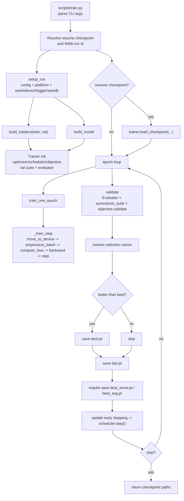
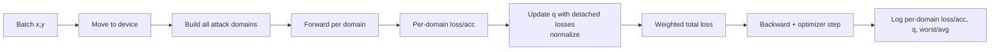

# Training Protocols (ARDG)

Single-page reference for setup, pipelines, configs, and the five training protocols: **ERM**, **PGD-AT**, **Multi-Attack ERM**, **GroupDRO**, **GroupDRO++** (GroupDRO-inspired).

## Setup
- Python: `python3 -m venv .venv && source .venv/bin/activate && pip install -e .`  
  Extras: `.[wandb]`, `.[autoattack]`, `.[dev]` when needed.
- Platforms: `--platform local` uses `/content/HK252-CO4337-DATN`, `--platform colab` uses `/content/drive/MyDrive/HK252-CO4337-DATN`.
- Colab + Docker: mount project at `/content/drive/MyDrive/HK252-CO4337-DATN`, run `!python scripts/train.py ... --platform colab`.
- W&B: set `logging.wandb.enabled=true`; resumes can pass `--wandb_run_id <id>`.

## Pipelines
- **Training**: `scripts/train.py` → config load → dataloaders/model → objective (`train.mode`) → trainer loop → checkpoints (`best.pt`, `last.pt`, optional `best_worst.pt`, `best_avg.pt`).
- **Evaluation**: `scripts/evaluate.py` → config + checkpoint → test loader → `attack.eval_suite` → clean + per-attack metrics with worst/avg summaries.

## Config Contract (train)
```yaml
experiment: {seed: 42, device: cuda, precision: fp32|fp16, deterministic: true}
dataset: {name: cifar10, data_dir: <platform resolved>, val_ratio: 0.02, num_workers: 8, augmentation: standard|randaugment}
model: {name: resnet50_cifar|resnet18_cifar|vit_b16_cifar, num_classes: 10, pretrained: false}
train:
  mode: erm|pgd_at|multi_attack_erm|groupdro|groupdro_plus
  epochs: 100
  batch_size: 256
  optimizer: {name: sgd, lr: 0.1, momentum: 0.9, weight_decay: 0.0005}
  scheduler: {name: cosine, t_max: 100, eta_min: 0.0}
  early_stopping: {enabled: true, metric: acc, mode: max, patience: 15, warmup_epochs: 20}
attack:
  train: …               # for adv modes
  val: …                 # clean/pgd20 etc.
  eval_suite:            # preferred eval path (used by eval + optional train-time checks)
    max_batches: 0
    attacks:
      - {label: pgd20, type: pgd, eps: 0.0313725, step_size: 0.007843, num_steps: 20, restarts: 5, loss: ce, random_start: true}
      - {label: autoattack, type: autoattack, norm: Linf, eps: 0.0313725, version: standard, n_classes: 10, verbose: false}
logging:
  wandb: {enabled: true, project: ardg, entity: "", group_template: "{model}/{stage}", add_default_tags: true}
  run_name: <string>
  output_dir: <platform resolved>
```

## Config Contract (eval)
```yaml
experiment: {...}
dataset: {...}
model: {...}
eval: {batch_size: 128}
attack:
  eval_suite:
    max_batches: 0
    attacks:
      - {label: pgd20, type: pgd, eps: 0.0313725, step_size: 0.007843, num_steps: 20, restarts: 5, loss: ce, random_start: true}
      - {label: autoattack, type: autoattack, norm: Linf, eps: 0.0313725, version: standard, n_classes: 10, verbose: false}
logging: {...}
```

## Protocols (idea • pseudocode • checkpoints/metrics)
- **ERM**  
  Idea: clean CE baseline. Checkpoint: `val/acc_clean`.  
  Pseudocode: `x,y= batch → logits=model(x) → loss=CE → acc=mean(argmax==y)`.
- **PGD-AT**  
  Idea: generate adversarial batch with PGD then train on it. Checkpoint: `val/acc` on attacked val set.  
  Pseudocode: `x_adv = attack(x,y); logits=model(x_adv); loss=CE; acc_adv`.
- **Multi-Attack ERM**  
  Idea: treat attacks as domains; sample one/many domains per batch; average CE across domains; optional PGD20 probe validation. Checkpoints: primary `val/pgd20_probe_acc` then `val/acc`.  
  Pseudocode (per_batch): `d ~ Uniform(domains); x_d = attack_d(x,y); loss=CE(model(x_d),y)`.
- **GroupDRO**  
  Idea: same fixed domains as Multi-Attack but weight by learned `q`. Checkpoint: `val/acc_worst`, `val/acc_avg`, `val/acc_clean`.  
  Pseudocode: `x_domains = all attacks; loss_g = CE per domain; q ← q*exp(eta*loss_g); loss=sum(q*loss_g)`.
- **GroupDRO++ (proposed)**  
  Idea: cluster logits into pseudo-groups (batch or epoch k-means), apply GroupDRO weighting + regularizer. Checkpoint: robust metrics; monitor `q_entropy` and cluster losses.  
  Pseudocode: `cluster_ids = kmeans(logits); loss_g per cluster; q update; total = sum(q*loss_g) + λ*reg`.

## Flowcharts (Mermaid)




## Run Recipes (per protocol)
- Local ERM: `python scripts/train.py --config configs/local/resnet50/train/erm.yaml --platform local --verbose`
- Local PGD-AT: `python scripts/train.py --config configs/local/resnet50/train/pgd_at.yaml --platform local --verbose`
- Local Multi-Attack ERM: `python scripts/train.py --config configs/local/resnet50/train/multi_attack_erm.yaml --platform local --verbose`
- Local GroupDRO: `python scripts/train.py --config configs/local/resnet50/train/groupdro.yaml --platform local --verbose`
- Colab variants: change `--platform colab` and use matching `configs/colab/...` files.
- Eval (all attacks): `python scripts/evaluate.py --config configs/colab/resnet50/eval/all_attacks.yaml --platform colab --checkpoint /content/drive/MyDrive/HK252-CO4337-DATN/outputs/<RUN>/best.pt --deterministic --seed 42 --verbose`

## Outputs and Logging
- Run directory: `logging.output_dir/<run_name>/` with `best.pt`, `best_worst.pt` (multi-attack/groupdro), `best_avg.pt`, `last.pt`, `train_history.jsonl`, `train_summary.json`.
- W&B grouping via `logging.wandb.group_template` (e.g., `{model}/{stage}`); resume with `--wandb_run_id`.

## Archive
- Previous planning/pseudocode materials moved to `docs/archive/` for reference.
